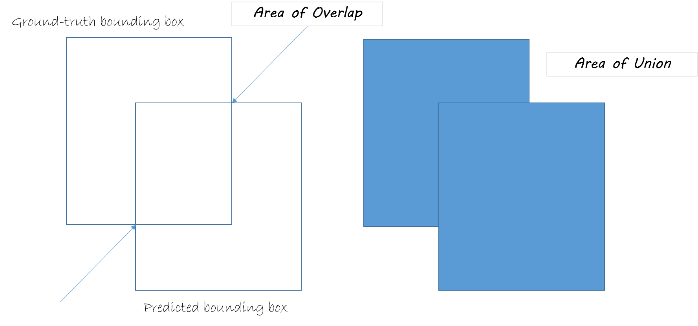

## Object Detection

### Evaluation Methods

#### IoU: Intersection over Union

It's an interesting name because it just means what it is called:

$$
IoU = \frac{Area \space of \space Overlap}{Area \space of \space Union}
$$

To help better understand the conception, I'd like to give a more clear graph:

