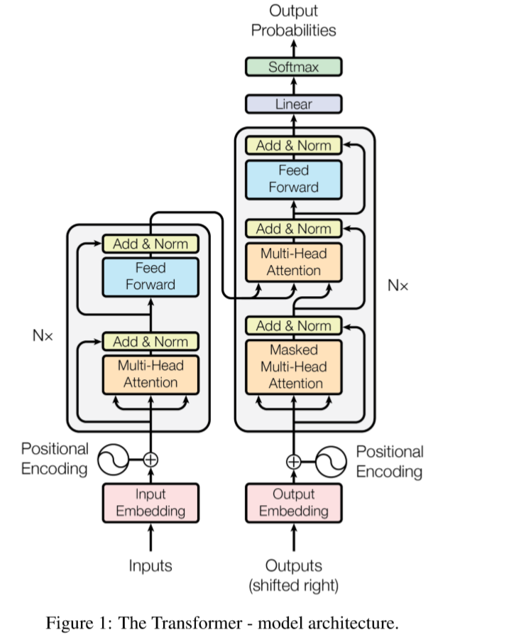
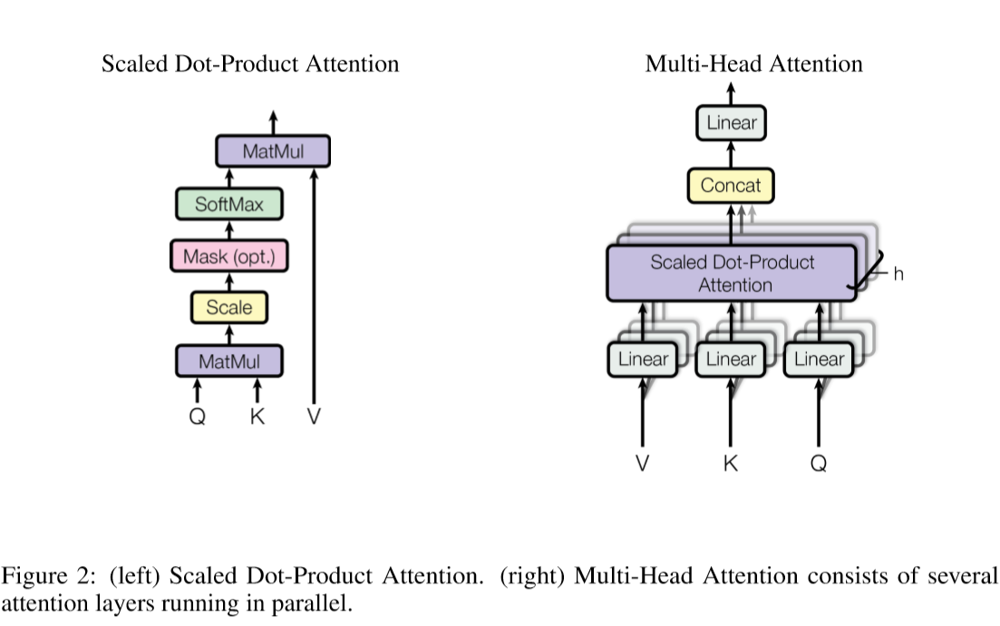

## Ideas

This chapter collects some brilliant ideas proposed by creative authors.

### Attention

#### Introduction

This is highlighted by Google team in their *Attention Is All You Need*. The attention mechanism is not something state of the art but in most cases it is an integral part of a recurrent network. In this paper, they propose a transformer "*eschewing recurrence and instead relying entirely on an attention machanism to draw more pallelization*. The characteristic of the new model architecture should certainly be the short training period. As stated in the paper:

> In the Transformer this (the number of operations required to relate signals from two arbitrary input and output positions) is reduced to a constant number of operations, albeit at the cost of reduced effective resolution due to averaging attention-weighted positions, an effect we counteract with Multi-Head Attention as described in section 3.2. 

#### Model Architecture

The model architcture graph is as follows:

Here, the encoder maps an input sequence of symbol representations $$(x_1,...,x_n)$$ to a sequence of continuous representations $$z = (z_1,...,z_n)$$. Given $$z$$, the decoder then generates an output sequence $$(y_1,...,y_m)$$ of symbols one element at a time. At each step the model is auto-regressive, consuming the previously generated symbols as additional input when generating the next.

##### Encoder and Decoder Stacks 

**Encoder**: The encoder is composed of a stack of $$N = 6$$ identical layers. Each layer has two sub-layers. The first is a multi-head self-attention mechanism, and the second is a simple, positionwise fully connected feed-forward network. We employ a residual connection around each of the two sub-layers, followed by layer normalization. That is, the output of each sub-layer is $$LayerNorm(x + Sublayer(x))$$, where $$Sublayer(x)$$ is the function implemented by the sub-layer itself. To facilitate these residual connections, all sub-layers in the model, as well as the embedding layers, produce outputs of dimension $$d_{model} = 512$$.

**Decoder**: The decoder is also composed of a stack of $$N = 6$$ identicallayers. In addition to the two sub-layers in each encoder layer, the decoder inserts a third sub-layer, which performs multi-head attention over the output of the encoder stack. Similar to the encoder, we employ residual connections around each of the sub-layers, followed by layer normalization. We also modify the self-attention sub-layer in the decoder stack to prevent positions from attending to subsequent positions. This masking, combined with fact that the output embeddings are offset by one position, ensures that the predictions for position $$i$$ can depend only on the known outputs at positions less than $$i$$.

##### Attention

An attention function can be described as mapping a query and a set of key-value pairs to an output, where the query, keys, values, and output are all vectors. The output is computed as a weighted sum of the values, where the weight assigned to each value is computed by a compatibility function of the query with the corresponding key.

###### Scaled Dot-Product Attention

The input consists of queries and keys of dimension $$d_k$$, and values of dimension $$d_v$$. We compute the dot products of the query with all keys, divide each by $$\sqrt{d_k}$$, and apply a softmax function to obtain the weights on the values. 

In practive, the matrix of the outputs:
$$
Attention(Q,K,V) = softmax(\frac{QK^T}{\sqrt{d_k}}) V
$$

In theoretical complexity, dot-product attention and additive attention are similar. But dot-product attention is much faster and more space-efficient in practice, since it can be implemented using highly optimized matrix multiplication code.

###### Multi-Head Attention

Instead of performing a single attention function with dmodel-dimensional keys, values and queries, **we found it beneficial to linearly project the queries, keys and values $$h$$ times with different, learned linear projections to $$d_k$$, $$d_k$$ and $$d_v$$ dimensions, respectively**. On each of these projected versions of queries, keys and values we then perform the attention function in parallel, yielding dv-dimensional output values. These are concatenated and once again projected, resulting in the final values, as depicted in Figure 2.

Multi-head attention allows the model to jointly attend to information from different representation subspaces at different positions. With a single attention head, averaging inhibits this.
$$
\begin{align*}
MultiHead(Q,K,V) &= Concat(head1,...,headh)W^O \\
where \space head_i &= Attention(Q W^Q_i, K W^K_i, V W^V_i)
\end{align*}
$$

Where the projections are parameter matrices $$W^Q_i \in \mathbb{R}^{d_{model}\times d_k}, W^K_i \in \mathbb{R}^{d_{model}\times d_k}, W^V_i \in \mathbb{R}^{d_{model} \times d_v}$$ and $$W^O \in \mathbb{R}^{h d_v \times d_{model}}$$. In this work we employ $$h = 8$$ parallel attention layers, or heads. For each of these we use $$d_k = d_v = d_{model}/h = 64$$. Due to the reduced dimension of each head, the total computational cost is similar to that of single-head attention with full dimensionality.

