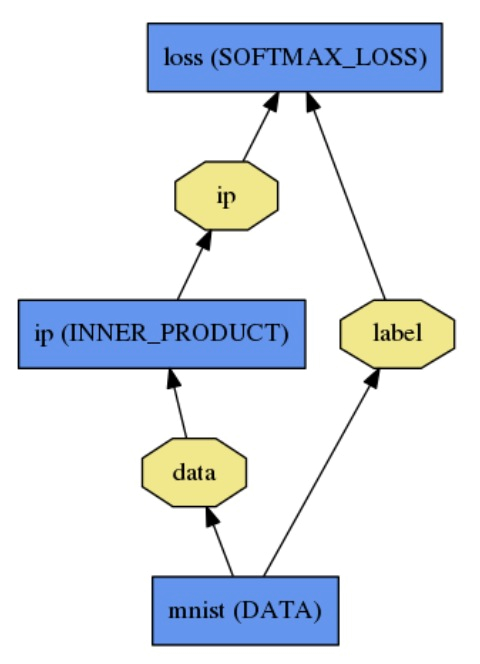

## Caffe Framework

### Blob

#### Basic Conception

A wrapper over the actual data being processed and passed along by Caffe. 

Conceal the computational and mental overhead of mixed CPU/GPU operation by synchronizing from the CPU host to the GPU device as needed.

#### Structure

The conventional blob dimensions for batches of image data are 
$$
N \times K \times H \times W
$$
with $$N$$ - number, $$K$$ - channel, $$H$$ - height, $$W$$ - width.

Blob memory is **row-major** in layout, so the last / rightmost dimension changes fastest. For example, in a 4D blob, the value at index $$(n, k, h, w)$$ is physically located at index 
$$
((n \times K + k) \times H + h) \times W + w
$$
$$N$$ - batch size of the data, $$K$$ - feature dimension (e.g. for RGB images $$K = 3$$)

To better understand the conception here, I'd like to take an example:

For a convolution layer with 96 filters of $$11 \times 11$$ spatial dimension and 3 inputs the blob is $$96 \times 3 \times 11 \times 11$$.

#### Feature

In fact, a Blob stores 2 chunks of memories, data and diff. 

#### Application

For custom data it may be necessary to hack your own input preparation tool or data layer. However once your data is in your job is done. The modularity of layers accomplishes the rest of the work for you.


### Layer

#### Basic Conception

The layer is the essence of a model and the fundamental unit of computation. Layers convolve filters, pool, take inner products, apply nonlinearities like rectified-linear and sigmoid and other elementwise transformations, normalize, load data, and compute losses like softmax and hinge. 

Layer operations can be referred at http://caffe.berkeleyvision.org/tutorial/layers.html .

#### Behavior

Each layer type defines three critical computations: *setup*, *forward*, and *backward*.

* Setup: initialize the layer and its connections once at model initialization.
* Forward: given input from bottom compute the output and send to the top.
* Backward: given the gradient w.r.t. the top output compute the gradient w.r.t. to the input and send to the bottom. A layer with parameters computes the gradient w.r.t. to its parameters and stores it internally.

More specifically, there will be two Forward and Backward functions implemented, one for CPU and one for GPU. If you do not implement a GPU version, the layer will fall back to the CPU functions as a backup option. This may come handy if you would like to do quick experiments, although it may come with additional data transfer cost (its inputs will be copied from GPU to CPU, and its outputs will be copied back from CPU to GPU).


### Net

#### Basic Conception

The net jointly defines a function and its gradient by composition and auto-differentiation. The composition of every layer’s output computes the function to do a given task, and the composition of every layer’s backward computes the gradient from the loss to learn the task. Caffe models are end-to-end machine learning engines.

#### Architecture (explained with an example)

Let's take a simple logistic regression classifier for instance:



It's defined by:

```python
name: "LogReg"
layer {
  name: "mnist"
  type: "Data"
  top: "data"
  top: "label"
  data_param {
    source: "input_leveldb"
    batch_size: 64
  }
}
layer {
  name: "ip"
  type: "InnerProduct"
  bottom: "data"
  top: "ip"
  inner_product_param {
    num_output: 2
  }
}
layer {
  name: "loss"
  type: "SoftmaxWithLoss"
  bottom: "ip"
  bottom: "label"
  top: "loss"
}
```


### Model Format

#### Basic Conception

The models are defined in plaintext protocol buffer schema (prototxt) while the learned models are serialized as binary protocol buffer (binaryproto) `.caffemodel` files.

#### Application

The model format is defined by the protobuf schema in caffe.proto. The source file is mostly self-explanatory so one is encouraged to check it out.


### Forward and Backward

#### Basic Conception

The **forward** pass computes the output given the input for inference. In forward Caffe composes the computation of each layer to compute the “function” represented by the model. This pass goes from bottom to top.

The **backward** pass computes the gradient given the loss for learning. In backward Caffe reverse-composes the gradient of each layer to compute the gradient of the whole model by automatic differentiation. This is back-propagation. This pass goes from top to bottom.

To give a brief summary, the forward pass is like the procedure of producing a product, while the backward pass is like the process where as producers we obtain a feedback from the guests or consumers and try to improve the quality of our products.

#### Application

Forward and backward computations follow immediately from defining the model: Caffe plans and carries out the forward and backward passes for you.

- The `Net::Forward()` and `Net::Backward()` methods carry out the respective passes while `Layer::Forward()` and `Layer::Backward()` compute each step.
- Every layer type has `forward_{cpu,gpu}()` and `backward_{cpu,gpu}()` methods to compute its steps according to the mode of computation. A layer may only implement CPU or GPU mode due to constraints or convenience.

The Solver optimizes a model by first calling forward to yield the output and loss, then calling backward to generate the gradient of the model, and then incorporating the gradient into a weight update that attempts to minimize the loss. Division of labor between the Solver, Net, and Layer keep Caffe modular and open to development.


### Solver

#### Basic Conception

The solver orchestrates model optimization by coordinating the network’s forward inference and backward gradients to form parameter updates that attempt to improve the loss. The responsibilities of learning are divided between the Solver for overseeing the optimization and generating parameter updates and the Net for yielding loss and gradients.

#### Behavior

The solver

1. scaffolds the optimization bookkeeping and creates the training network for learning and test network(s) for evaluation.
2. iteratively optimizes by calling forward / backward and updating parameters
3. (periodically) evaluates the test networks
4. snapshots the model and solver state throughout the optimization

where each iteration

1. calls network forward to compute the output and loss
2. calls network backward to compute the gradients
3. incorporates the gradients into parameter updates according to the solver method
4. updates the solver state according to learning rate, history, and method

to take the weights all the way from initialization to learned model.


### Data

#### Basic Conception

Data flows through Caffe as **Blobs**. Data layers load input and save output by converting to and from Blob to other formats. Common transformations like mean-subtraction and feature-scaling are done by data layer configuration. New input types are supported by developing a new data layer – the rest of the Net follows by the modularity of the Caffe layer catalogue.

**BTW**: *I provide a thorough analysis about the development of new data layers in the next section. If you are interested (probably in fact), you could refer to it.* 


### Convolution Computation

Now let's take a closer look at the detail of the computation of Caffe's convolution:

Loosely speaking, assume that we have a W * H image with depth D at each input location. For each location, we get a K * K patch, which could be considered as a K * K * D vector, and apply M filters to it. In pseudocode, this is (ignoring boundary conditions):

```C++
for w in 1..W
  for h in 1..H
    for x in 1..K
      for y in 1..K
        for m in 1..M
          for d in 1..D
            output(w, h, m) += input(w+x, h+y, d) * filter(m, x, y, d)
          end
        end
      end
    end
  end
end
```

> The trick is to just lay out all the local patches, and organize them to a (W * H, K * K * D) matrix. In Matlab, this is usually known as an im2col operation. After that, consider the filters being a (M, K * K * D) matrix too, the convolution naturally gets reduced to a matrix multiplication (Gemm in BLAS) problem. We have awesome BLAS libraries such as MKL, Atlas, and CuBLAS, with impressive performances. This applies to GPUs as well, although GPU memory is indeed more "precious" than its CPU sibling. However, with reasonably large models such as ImageNet, Caffe has been working pretty OK. It is even able to process videos with such models, thanks to the recent advances in GPU hardware.

---

## Caffe File Structure

First let's take a look at the directories under `$CAFFE_ROOT_DIR`:

#### src

```C
.
├── caffe
│   ├── layers
│   ├── proto
│   ├── solvers
│   ├── test
│   │   └── test_data
│   └── util
└── gtest
```

The `src` includes the implementation of those encapsulated Caffe layers, which means that if you want to add new layers or make change to existing layers, you must modify the `src` directory. In fact, `src` is the core of the Caffe project which means an equivalent position as CPU to a personal computer.

Now let's begin with `proto`.  Typically, there is only one important file, `caffe.proto`, under `proto`. This is the total configuration file where each layer parameter class is defined. Sometimes you may meet with an "undefined" error when you make under the `$CAFFE_ROOT_DIR` and it's just because you forget to add parameter statement into the proto file. For more detail, you can refer to `tips.md > How to add layers`.

`layers` contains the `C++` implementation files and `cu` files of predefined or user-defined Caffe layers. `util` includes some useful `C++` libraries that are invoked by the files in `layers`. 

